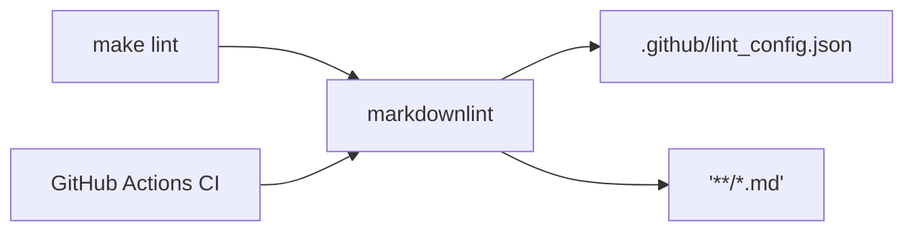

# PLAN — 决策与路径

## 目标

在保持改动范围最小的前提下，让：

1. CI 的 `markdown-lint` 阶段可执行且退出 0；
2. 本地 `make lint` 与 CI 完全一致（不会假通过）；
3. 迁移后仍会误导执行的旧路径指引被修复；
4. `.gitignore` 与新结构一致，避免产物污染工作区。

## 方案对比（至少两种）

### 方案 A（推荐）：补齐 `.github/lint_config.json` + 对齐 Makefile + 最小修文档/忽略

**做法**
- 新增 `.github/lint_config.json`，以“最小放宽”让现有文档可通过。
- 更新 `Makefile`：使用与 CI 相同的 glob 形式（引用 `'**/*.md'`），并指向同一 config。
- 修复少量关键文档旧路径（仅指引类 README/参考文档）。
- 更新 `.gitignore` 覆盖 `assets/repo/backups/gz/` 与迁移后的 venv 路径。

**Pros**
- 改动小、可回滚、最容易让 CI 回绿。
- 不需要全仓重排 Markdown。

**Cons**
- 可能需要在 lint config 中禁用部分规则（需要记录原因，避免“质量坍塌”）。

### 方案 B：严格 lint（少放宽）+ 大范围修正文档格式

**做法**
- 补齐 `.github/lint_config.json`，尽量保持严格规则；
- 逐个修正文档以满足规则（可能涉及大量文件）。

**Pros**
- 长期文档质量更稳定，规则更强约束。

**Cons**
- 成本巨大、风险高（断链/误改内容/大 PR 难回滚），不符合“最少修改原则”。

## 决策

选择 **方案 A**。若后续需要提升文档质量，再开独立任务做“严格化 + 大规模修复”，避免一次 PR 混入两类目标。

## 逻辑流图（Mermaid）

## 原子变更清单（文件级，不写代码）

1. 新增：`.github/lint_config.json`（最小放宽，明确记录禁用项原因）。
2. 修改：`Makefile` 的 `lint` 目标：
   - 使用 quoted glob：`'**/*.md'`
   - 使用 `--config .github/lint_config.json`
3. 修改：`.gitignore`：
   - 忽略 `assets/repo/backups/gz/`
   - 更新旧路径忽略项（如 `skills/skills-skills/...` → `assets/skills/...`）
4. 修改：`assets/config/.codex/README.md`（复制命令路径纠正）。
5. 修改：`assets/skills/skills-skills/references/*.md`（示例路径纠正）。
6. 评估（可选）：是否需要限定 lint 范围/忽略 `assets/repo/**`（若第三方镜像导致无法通过）。

## 回滚协议（自愈步骤）

若任何一步导致 lint 或文档入口不可用：

1. `git status --porcelain=v1` 确认改动文件集合
2. `git restore --staged --worktree <file...>` 回退到改动前（或 `git revert <commit>` 若已提交）
3. 重新跑：
   - `make lint`
   - `markdownlint --config .github/lint_config.json '**/*.md'`
4. 若仅 `.github/lint_config.json` 导致行为异常，可先临时移除该文件再复验，以确认根因

